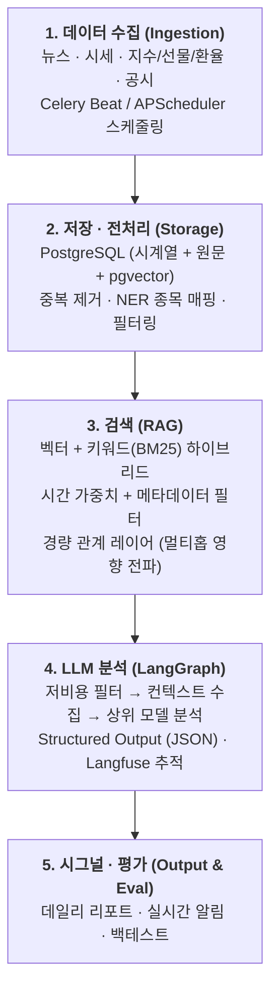
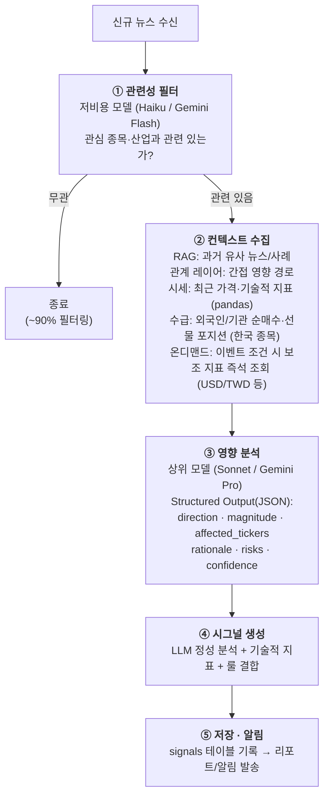

# 주식 분석 LLM 시스템 설계 문서

> **버전**: v0.9 · **작성일**: 2026-07-09 · **갱신**: 2026-07-14 (시세 수집을 KIS 웹소켓 실시간으로 확정, tick 저장 스키마 추가)
> **주의**: 이 문서는 첫 설계 초안 기반이다. 코드와 다르면 코드가 소스 오브 트루스 — 구현하며 계속 갱신한다.
> **목적**: 확정된 추적 종목 9개(한국 2 + 미국 7, §1.4)에 대한 뉴스·시세 기반 LLM 분석/시그널 생성 시스템의 전체 설계
> **성격**: 개인 분석 도구 및 AI/LLM 엔지니어링 포트폴리오 프로젝트 (자동매매 아님)

---

## 1. 개요

### 1.1 시스템 정의

뉴스, 공시, 시세, 매크로 지표(지수·선물·환율)를 수집하고, RAG와 LLM을 결합해
관심 종목에 대한 **영향 분석과 시그널**을 생성하는 시스템.

### 1.2 핵심 설계 원칙

| 원칙 | 내용 |
|---|---|
| LLM = 해석·판단 엔진 | LLM에게 가격 예측을 직접 시키지 않는다. 뉴스/이벤트의 의미 해석, 종목 영향 판단, 근거 생성을 담당 |
| 하이브리드 시그널 | LLM 정성 분석 + 기술적 지표(pandas 계산) + 룰 기반 로직을 결합 |
| 평가 우선 | 시그널 → 실제 수익률 백테스트 파이프라인을 초기부터 구축. 모든 개선은 이 지표로 검증 |
| API 우선, 파인튜닝은 후순위 | 초기에는 Claude/Gemini API 사용. 운영 로그가 쌓인 뒤 오픈소스 LLM 파인튜닝 |
| 범위 한정 | 전 종목이 아닌 확정된 9개 종목(§1.4)만 대상. 인프라를 경량으로 유지 |

### 1.3 명시적 비목표 (Non-goals)

- 자동매매 실행 (자본시장법상 라이선스 이슈, 프로젝트 범위 외)
- 투자 자문 서비스화 (출력물에 "검증되지 않은 분석" 고지 포함)
- 전 종목 커버리지

### 1.4 추적 대상 종목 (확정)

| 시장 | 티커 | 종목명 | 유형 | 비고 |
|---|---|---|---|---|
| KRX | 005930 | 삼성전자 | 개별주 | KIS API 수집 |
| KRX | 000660 | SK하이닉스 | 개별주 | NVDA HBM 공급 관계 → 관계 레이어 핵심 노드 |
| NASDAQ | AAPL | 애플 | 개별주 | |
| NASDAQ | GOOGL | 알파벳(구글) | 개별주 | GOOGL(Class A) 기준, GOOG는 별칭 등록 |
| NASDAQ | MSFT | 마이크로소프트 | 개별주 | |
| NASDAQ | META | 메타 | 개별주 | |
| NASDAQ | NVDA | 엔비디아 | 개별주 | |
| NASDAQ | QQQ | Invesco QQQ | ETF | 나스닥100 추종 — 시그널 대상 겸 시장 벤치마크 |
| NYSE Arca | SPY | SPDR S&P 500 | ETF | S&P500 추종 — 시그널 대상 겸 시장 벤치마크 |

**종목 구성 관련 설계 메모**:

- **ETF 이중 역할**: QQQ/SPY는 개별 시그널 대상이면서 §8 백테스트의 **시장 기준선**
  역할을 겸한다 (개별주 시그널의 초과수익 여부를 이 벤치마크 대비로 평가).
- **높은 상관 구조**: 미국 5개 개별주는 모두 QQQ/SPY의 상위 구성 종목이므로,
  빅테크 공통 이벤트(금리·AI 규제 등)는 매크로 시그널로 묶어 처리하고
  종목별 시그널은 개별 고유 이벤트에 집중한다.
- **뉴스 필터 기준**: ① 9개 종목 직접 언급, ② 관계 레이어 1~2홉 이내 엔티티
  (TSMC, 반도체 업황, AI 인프라 등) 언급, ③ 매크로(연준·환율·지수 급변) —
  이 세 범주 외 뉴스는 ①차 필터에서 제외.
- **엔티티 별칭 등록 필수**: 예) 삼성전자 = {005930, Samsung Electronics, 삼전},
  알파벳 = {GOOGL, GOOG, Google, 구글, Alphabet}.

### 1.5 매크로 지표 (시장 컨텍스트)

개별 시그널 대상이 아닌, 분석 컨텍스트와 관계 레이어의 매크로 노드로 사용하는 지표.
**T1 = 항상 LLM 컨텍스트에 요약 주입 / T2 = 급변·이벤트 시에만 참조 /
T3 = 수집·저장만 하고 분석 미투입 (히스토리 축적 목적, 백테스트 검증 후 승격).**

| 분류 | 지표 | 수집 소스 | 티어 | 비고 |
|---|---|---|---|---|
| 지수 | S&P500, NASDAQ, KOSPI, VIX | yfinance / KIS API | T1 | |
| 지수 | **필라델피아 반도체지수 (SOX)** | yfinance `^SOX` | T1 | 삼성전자·하이닉스·NVDA 직결 — 반도체 섹터 체온계 |
| 지수 (중국) | **상하이종합, 항셍, 항셍테크** | yfinance `000001.SS`, `^HSI`, HSTECH | T2 | 중국 경기·기술주 심리 |
| 지수 (일본) | **Nikkei225** | yfinance `^N225` | T2 | 한국장과 시간대 중첩 — 아시아 위험선호 지표. 엔화 강세 + 닛케이 급락 = 리스크 오프 신호 |
| 지수 (대만) | **TAIEX (대만가권)** | yfinance `^TWII` | T2 | 반도체 공급망 심리 |
| 지수 | **러셀2000 (소형주)** | yfinance `^RUT` | T2 | QQQ 대비 상대 강도 → 메가캡→소형주 순환매·시장 폭(breadth) 감지, 금리 민감 지표 |
| 개별 참조 | **TSMC ADR (TSM)** | yfinance `TSM` | T2 | 시그널 대상 아님 — NVDA·AAPL·반도체 공급망 핵심 참조 가격 |
| 선물 | S&P500·NASDAQ 지수 선물 | yfinance | T1 | 프리마켓 방향성 |
| 선물 | **KOSPI200 선물 (가격 + 베이시스)** | KIS API | T1 | 외국인 포지션(§수급)과 결합 해석 |
| 환율 | USD/KRW | yfinance (`KRW=X`) | T1 | 수출주 실적·외인 수급 |
| 환율 | USD/JPY (엔/달러) | yfinance (`JPY=X`) | T1 | 엔캐리 트레이드 — 급격한 엔화 강세 = 유동성 축소 신호 |
| 환율 | JPY/KRW (엔/원) | yfinance (`JPYKRW=X`) | T2 | 수출 경합 맥락 |
| 환율 | **USD/CNY·CNH (위안)** | yfinance (`CNY=X`, `CNH=X`) | T2 | 역외 CNH가 시장 스트레스를 더 빠르게 반영 — 급변 시 T1 승격. 위안 절하 = 리스크 오프 |
| 환율 | **달러인덱스 (DXY)** | yfinance (`DX-Y.NYB`) | T1 | 글로벌 달러 유동성 종합 |
| 채권 (미) | **국채 2Y / 10Y / 30Y 금리 + 10Y-2Y 스프레드** | FRED API (`DGS2`, `DGS10`, `DGS30`) + yfinance `^TNX` | T1 | 빅테크 밸류에이션 직결, 장단기 역전 = 침체 신호 |
| 채권 (한) | **국고채 3Y / 10Y + 한은 기준금리** | 한국은행 ECOS OpenAPI | T1 | 국내 금리 환경 |
| 채권 (일) | **일본 국채 10Y 금리 + BOJ 금리 결정·총재 발언** | 크롤링(투자정보 사이트) + econ_calendar 이벤트 | T2 | 엔캐리 해석 보강 — JGB 금리 급등·BOJ 긴축 = 엔캐리 청산 리스크 |
| 반도체 | **TSMC 월매출** | TSMC IR 발표 (매월 10일경) 크롤링 | T1 | 글로벌 반도체 수요의 월 단위 최선행 지표 — NVDA·AAPL·국내 반도체 공통 |
| 반도체 | **DRAM / NAND 현물가 (+ HBM 수요 뉴스)** | 초기: 뉴스 기반 이벤트 추출 + 주간 크롤링 (TrendForce 등 유료 API는 추후 검토) | T1 | 삼성전자·SK하이닉스 실적의 가장 직접적인 선행 지표 |
| 원자재 | **WTI 유가, 금, 구리** | yfinance (`CL=F`, `GC=F`, `HG=F`) | T2 | 구리 = 경기 선행, 금 = 리스크 오프, 유가 = 인플레 압력 |
| 경기지표 (미) | **CPI, 고용(NFP), ISM PMI, FOMC 금리 결정** | FRED API + 경제 캘린더 | T1 | 발표 이벤트 자체가 시장 단위 시그널 트리거 |
| 경기지표 (중) | **제조업 PMI (국가통계국·차이신), 산업생산** | 발표치 수집 (FRED `CHNPMI` 대용 / 캘린더 크롤링) | T2 | 중국 경기 → 한국 수출·반도체 수요 경로 |
| 경기지표 (한) | **수출입 통계 — 특히 반도체 수출액** | 관세청 수출입 통계 (10일 단위 발표) | T1 | 삼성전자·하이닉스 실적의 최선행 지표 |
| 수급 | 한국 시장·종목별 외국인/기관 순매수 | KIS API 투자자별 매매동향 | T1 | 삼성전자·하이닉스 단기 수급의 핵심 변수 |
| 수급 | KOSPI200 선물 외국인 포지션 | KIS API 선물옵션 매매동향 | T1 | 선물 수급 → 현물 방향성 선행 지표 |
| 수급 | **프로그램 매매 순매수 (시장·종목별)** | KIS API 프로그램매매 동향 | T3 | 외국인 순매수의 성격 구분 (차익 물량 vs 실질 매수) — Day 1부터 축적 |
| 수급 | **공매도 거래대금·잔고 (삼전·하이닉스)** | KRX 공매도통합포털 + KIS API | T3 | **잔고는 T+2 공시 — `published_at` 필수 기록** (look-ahead bias 방지) |
| 수급 | **대차잔고** | 금융투자협회 FreeSIS 크롤링 (일 1회) | T3 | 공매도 대기 물량 추정 |
| 수급 | **신용융자 잔고** | 금융투자협회 FreeSIS 크롤링 (일 1회) | T3 | 개인 레버리지 과열도 |

**매크로 지표 설계 메모**:

- 수집 주기는 15분~1시간 (채권 금리·경기지표는 일 1회 / 발표 시점).
- 저장은 §4.2 시계열 테이블을 공용 사용 (`instruments`에 `type='macro'`로 등록).
- LLM 분석(§7) 시 ②컨텍스트 수집 단계에서 **T1 지표의 최근 스냅샷**
  (금리 수준·변화, 환율 추세, VIX, SOX, 수급)을 요약 주입. T2는 임계치 초과
  변동(예: 위안 1% 이상 절하) 시에만 컨텍스트에 포함.
- **경제 이벤트 캘린더**: FOMC, 미국 CPI/고용, 한은 금통위, 중국 PMI, 한국 수출입
  발표 일정을 별도 테이블(`econ_calendar`)로 관리. 발표 직전에는 시그널을 보수적으로
  조정하고, 발표 직후에는 시장 단위(QQQ/SPY/KOSPI) 분석을 트리거.
- **지표 비대화 방지 원칙**: 모든 지표는 ②컨텍스트 요약 또는 룰 로직에서 실제로
  사용될 때만 유지. 3개월간 어떤 시그널에도 기여하지 않은 지표는 수집 중단 검토.
- **의도적 제외 — 다우존스(DJIA)**: S&P500과 정보 중복이 크고 가격가중 방식의
  구조적 한계로 분석 기준 가치가 낮아 수집하지 않음. 러셀2000은 반대로
  메가캡 집중 포트폴리오의 순환매 리스크 감지용으로 채택 (위 표 참조).
- **Phase 2 백로그 (당장 미수집)**: VKOSPI(수집 난이도 — 평가 대시보드 구축 후 필요 시),
  CSI300(상하이·항셍과 중복), **China A50 선물(SGX 거래로 본토장 폐장 시간에도 중국 심리
  반영 — Phase 2 장중 실시간 대응 도입 시 재검토)**, TOPIX(Nikkei와 중복 — 일본 개별
  섹터 분석 시 재검토), PBOC 고시환율(뉴스 이벤트로 감지, 수치는 USD/CNY·CNH로 대체).
  → 백테스트에서 기존 지표의 설명력 한계가 확인될 때 순차 도입.
- **온디맨드 조회 지표**: USD/TWD 등 "평상시 불필요, 이벤트 시에만 유의미"한 지표는
  정기 수집 대신 **LangGraph ②컨텍스트 수집 노드가 조건 충족 시(예: TAIEX·TSM 급락,
  대만 지정학 뉴스) yfinance를 즉석 조회**하는 방식으로 처리. 저장 파이프라인 없이
  참조 가능하며, 백로그 지표 전반에 재사용 가능한 범용 패턴.
- **T3(수집 전용) 도입 근거**: 프로그램 매매·공매도·대차잔고·신용융자는 분석 투입은
  나중이지만 **과거분 소급 수집이 번거로워** Day 1부터 축적. 수집 비용이 낮고
  (KIS API 엔드포인트 추가 + FreeSIS 일 1회 크롤링), 백테스트 검증 후 T2/T1 승격.
  공시 지연 데이터(공매도 잔고 T+2 등)는 백테스트 시 `published_at` 기준으로만 사용.
- **T2 우선 도입 원칙**: 신규 지표는 T2로 시작하고, 백테스트 기여도가 검증된
  것만 T1으로 승격한다.
- **매크로 이벤트 시그널**: FOMC, 급격한 금리/환율 변동은 종목별이 아닌
  시장 단위(QQQ/SPY) 시그널로 1회 처리 — §1.4 중복 분석 방지 원칙과 동일.

---

## 2. 전체 아키텍처



**기술 스택**: FastAPI · LangGraph · PostgreSQL(+pgvector) · Celery · Langfuse
· Claude/Gemini API (Phase 3에서 오픈소스 LLM + LoRA 추가 검토)

---

## 3. 데이터 수집 레이어

### 3.1 데이터 소스

| 데이터 | 한국 | 미국/글로벌 | 비용 |
|---|---|---|---|
| 시세 — 실시간 (체결/호가 tick) | KIS Developers OpenAPI 웹소켓 | KIS 해외주식 웹소켓 (미국 주간거래) | 무료 |
| 시세 — 일봉/과거 (OHLCV) | KIS OpenAPI | yfinance | 무료 |
| 지수·선물·환율 | KIS API (KOSPI, KOSDAQ) | yfinance (S&P500, NASDAQ, VIX, 선물, USD/KRW, **USD/JPY, JPY/KRW**) | 무료 |
| 채권 금리 | **한국은행 ECOS OpenAPI (국고채 3Y/10Y)** | **yfinance `^TNX` + FRED API (미국채 10Y/2Y)** | 무료 |
| **수급 동향** | **KIS API 투자자별 매매동향 (외국인/기관/개인 순매수 — 종목별·시장별), 보완: KRX 정보데이터시스템** | (해당 없음 — 한국 시장 특화) | 무료 |
| **선물 수급** | **KIS API 선물옵션 투자자별 매매동향 (KOSPI200 선물 외국인/기관 포지션)** | (해당 없음) | 무료 |
| **T3 수급 상세** | **KIS API 프로그램매매 + KRX 공매도통합포털 + 금투협 FreeSIS (대차/신용, 일 1회 크롤링)** | (해당 없음) | 무료 |
| **원자재·글로벌 지수** | (해당 없음) | yfinance (SOX, DXY, WTI, 금, 구리, 상하이·항셍) | 무료 |
| **경기지표** | 관세청 수출입 통계 (반도체 수출), 한국은행 ECOS | FRED API (CPI, 고용, PMI), 중국 PMI 발표치 | 무료 |
| **경제 캘린더** | FOMC·금통위·주요 지표 발표 일정 — 수동 등록 + 크롤링 보완 | 동일 | 무료 |
| 뉴스 | 네이버 뉴스 검색 API, 언론사 RSS | Finnhub / NewsAPI, 주요 매체 RSS | 무료 티어 |
| 공시 | DART OpenAPI | SEC EDGAR | 무료 |
| 보완 수집 | BeautifulSoup / Playwright 크롤러 (API 부재 소스) | 동일 | - |

### 3.2 수집 주기

| 데이터 | 주기 | 비고 |
|---|---|---|
| 시세 | 장중 웹소켓 실시간 (KIS 체결/호가 tick) | 장 마감 후 일봉 확정 배치 |
| 뉴스 | 5~15분 | 실시간 대응의 실질 병목 지점 |
| 공시 | 30분~1시간 | |
| 지수/선물/환율 | 15분 | USD/JPY, JPY/KRW 포함 |
| 채권 금리 | 1시간 ~ 일 1회 | 금리는 변동 빈도 낮음 — 일별 스냅샷으로 충분 |
| 수급 동향 (현물/선물) | 장중 잠정치 30분~1시간, 마감 후 확정치 1회 | 장중 데이터는 **잠정치**(provisional) 플래그로 구분 저장, 확정치로 덮어쓰기 |

### 3.3 스케줄링

- **Celery Beat** (또는 APScheduler)로 주기 작업 관리
- Kafka 등 스트리밍 인프라는 현재 규모(소수 종목)에서 불필요 — 의도적으로 배제
- 수집 실패 시 재시도 + 로깅 (수집 지연 자체를 메트릭으로 기록)
- KIS WebSocket 네트워크 단절은 백오프 후 재연결하지만, 필수 구독 거절 또는
  5초 내 구독 확인 실패는 해당 시장 수집 프로세스를 종료해 감시 프로세스가
  재시작하게 한다. `ALREADY IN SUBSCRIBE`는 멱등적 성공으로 처리한다.

---

## 4. 저장 · 전처리 레이어

### 4.1 저장소 구성 (PostgreSQL 단일화)

| 테이블 그룹 | 내용 | 비고 |
|---|---|---|
| 시계열 | 종목별 실시간 tick(체결/호가), OHLCV, 지수, 환율, 선물 | 규모 증가 시 TimescaleDB 확장 검토 |
| 원문 | 뉴스/공시 원문 + 메타데이터 | |
| 벡터 | 청크 + 임베딩 (pgvector) | |
| 관계 | 엔티티·관계 테이블 (§6 참조) | |
| 시그널/평가 | LLM 분석 결과, 시그널, 백테스트 기록 | |

### 4.2 핵심 스키마 (초안)

```sql
-- 종목/시세
CREATE TABLE instruments (
  id          SERIAL PRIMARY KEY,
  ticker      TEXT NOT NULL,          -- '005930', 'AAPL'
  market      TEXT NOT NULL,          -- 'KRX', 'NASDAQ', 'NYSE'
  name        TEXT NOT NULL,
  is_watched  BOOLEAN DEFAULT true
);

CREATE TABLE ohlcv (
  instrument_id INT REFERENCES instruments(id),
  ts            TIMESTAMPTZ NOT NULL,
  timeframe     TEXT NOT NULL,        -- '1m', '1d'
  open NUMERIC, high NUMERIC, low NUMERIC, close NUMERIC,
  volume BIGINT,
  PRIMARY KEY (instrument_id, timeframe, ts)
);

-- 실시간 tick (KIS 웹소켓 체결/호가 원시 데이터)
-- 설계 노트:
--  · 호가 10단계는 JSONB 단일 컬럼 — 소비 패턴이 항상 스냅샷 전체 복원이라 정규화 이득 없음
--  · v1은 종목코드 직저장, instruments 정착 후 FK 전환
--  · 모든 datetime은 timezone-aware UTC. KST/현지 시각 원본은 details JSONB에 보존
--  · 모든 ORM 모델은 EntityModel의 id/created_at/updated_at 공통 컬럼을 상속
CREATE TABLE korea_trades (
  id                        BIGSERIAL PRIMARY KEY,
  stock_code                TEXT NOT NULL,
  event_ts                  TIMESTAMPTZ NOT NULL, -- UTC 체결 시각
  price                     NUMERIC(28, 8) NOT NULL,
  volume                    BIGINT NOT NULL,
  cumulative_volume         BIGINT NOT NULL,
  cumulative_amount         NUMERIC(28, 8) NOT NULL,
  trade_strength            NUMERIC(20, 8),
  best_bid_price            NUMERIC(28, 8) NOT NULL,
  best_ask_price            NUMERIC(28, 8) NOT NULL,
  trade_classification_code TEXT NOT NULL,
  details                   JSONB NOT NULL,
  received_at               TIMESTAMPTZ NOT NULL DEFAULT now(),
  created_at                TIMESTAMPTZ NOT NULL DEFAULT now(),
  updated_at                TIMESTAMPTZ NOT NULL DEFAULT now()
);
CREATE INDEX ON korea_trades (stock_code, event_ts);

CREATE TABLE korea_orderbooks (
  id                 BIGSERIAL PRIMARY KEY,
  stock_code         TEXT NOT NULL,
  event_ts           TIMESTAMPTZ NOT NULL, -- UTC 호가 시각
  best_bid_price     NUMERIC(28, 8) NOT NULL,
  best_ask_price     NUMERIC(28, 8) NOT NULL,
  total_bid_quantity BIGINT NOT NULL,
  total_ask_quantity BIGINT NOT NULL,
  levels             JSONB NOT NULL,
  details            JSONB NOT NULL,
  received_at        TIMESTAMPTZ NOT NULL DEFAULT now(),
  created_at         TIMESTAMPTZ NOT NULL DEFAULT now(),
  updated_at         TIMESTAMPTZ NOT NULL DEFAULT now()
);
CREATE INDEX ON korea_orderbooks (stock_code, event_ts);

CREATE TABLE overseas_trades (
  id                  BIGSERIAL PRIMARY KEY,
  realtime_symbol     TEXT NOT NULL,
  symbol              TEXT NOT NULL,
  market              TEXT NOT NULL,
  event_ts            TIMESTAMPTZ NOT NULL, -- UTC 체결 시각
  local_business_date DATE NOT NULL,        -- 거래소 영업일이며 timestamp가 아님
  decimal_places      SMALLINT NOT NULL,
  price               NUMERIC(28, 8) NOT NULL,
  volume              BIGINT NOT NULL,
  cumulative_volume   BIGINT NOT NULL,
  cumulative_amount   NUMERIC(28, 8) NOT NULL,
  best_bid_price      NUMERIC(28, 8) NOT NULL,
  best_ask_price      NUMERIC(28, 8) NOT NULL,
  best_bid_quantity   BIGINT NOT NULL,
  best_ask_quantity   BIGINT NOT NULL,
  trade_strength      NUMERIC(20, 8),
  market_type         TEXT NOT NULL,
  details             JSONB NOT NULL,
  received_at         TIMESTAMPTZ NOT NULL DEFAULT now(),
  created_at          TIMESTAMPTZ NOT NULL DEFAULT now(),
  updated_at          TIMESTAMPTZ NOT NULL DEFAULT now()
);
CREATE INDEX ON overseas_trades (symbol, event_ts);

CREATE TABLE overseas_orderbooks (
  id                 BIGSERIAL PRIMARY KEY,
  realtime_symbol    TEXT NOT NULL,
  symbol             TEXT NOT NULL,
  market             TEXT NOT NULL,
  event_ts           TIMESTAMPTZ NOT NULL, -- UTC 호가 시각
  decimal_places     SMALLINT NOT NULL,
  best_bid_price     NUMERIC(28, 8) NOT NULL,
  best_ask_price     NUMERIC(28, 8) NOT NULL,
  best_bid_quantity  BIGINT NOT NULL,
  best_ask_quantity  BIGINT NOT NULL,
  total_bid_quantity BIGINT NOT NULL,
  total_ask_quantity BIGINT NOT NULL,
  levels             JSONB NOT NULL,
  details            JSONB NOT NULL,
  received_at        TIMESTAMPTZ NOT NULL DEFAULT now(),
  created_at         TIMESTAMPTZ NOT NULL DEFAULT now(),
  updated_at         TIMESTAMPTZ NOT NULL DEFAULT now()
);
CREATE INDEX ON overseas_orderbooks (symbol, event_ts);

-- 수급 동향 (한국 시장: 현물 종목별 + 선물 시장 단위)
CREATE TABLE investor_flows (
  id             BIGSERIAL PRIMARY KEY,
  instrument_id  INT REFERENCES instruments(id),  -- 종목별 수급. 선물/시장 단위는
                                                  -- 'KOSPI200_FUT' 등 macro instrument로 등록
  trade_date     DATE NOT NULL,
  investor_type  TEXT NOT NULL,        -- 'foreign', 'institution', 'retail',
                                       -- 'pension', 'trust', ...
  net_buy_value  BIGINT,               -- 순매수 금액 (원)
  net_buy_volume BIGINT,               -- 순매수 수량 (계약수/주식수)
  is_provisional BOOLEAN DEFAULT true, -- 장중 잠정치 여부 (확정치로 갱신)
  snapshot_ts    TIMESTAMPTZ DEFAULT now(),
  UNIQUE (instrument_id, trade_date, investor_type, is_provisional)
);

-- T3 수집 전용 일별 지표 (프로그램 매매, 공매도, 대차/신용 잔고 등)
CREATE TABLE daily_metrics (
  instrument_id INT REFERENCES instruments(id),  -- 시장 단위는 macro instrument 사용
  trade_date    DATE NOT NULL,                   -- 데이터 기준일
  metric        TEXT NOT NULL,                   -- 'program_net_buy', 'short_sale_value',
                                                 -- 'short_balance', 'loan_balance',
                                                 -- 'margin_loan_balance'
  value         NUMERIC,
  published_at  TIMESTAMPTZ NOT NULL,            -- 공시/입수 시점 — T+1·T+2 지연 데이터의
                                                 -- look-ahead bias 방지 (백테스트는 이 기준)
  PRIMARY KEY (instrument_id, trade_date, metric)
);

-- 경제 이벤트 캘린더 (FOMC, CPI, 금통위, 중국 PMI, 한국 수출입 등)
CREATE TABLE econ_calendar (
  id           SERIAL PRIMARY KEY,
  event_name   TEXT NOT NULL,          -- 'FOMC', 'US_CPI', 'BOK_RATE', 'BOJ_RATE',
                                       -- 'CN_PMI', 'KR_EXPORT', 'TSMC_REV'
  country      TEXT NOT NULL,          -- 'US', 'KR', 'CN'
  scheduled_at TIMESTAMPTZ NOT NULL,
  importance   SMALLINT,               -- 1~3 (발표 전 시그널 보수화 판단용)
  actual       TEXT,                   -- 발표치 (발표 후 기록)
  consensus    TEXT                    -- 시장 예상치
);

-- 뉴스/공시 원문
CREATE TABLE news (
  id           BIGSERIAL PRIMARY KEY,
  source       TEXT NOT NULL,         -- 'naver', 'finnhub', 'dart', 'edgar'
  url          TEXT UNIQUE,
  title        TEXT,
  body         TEXT,
  published_at TIMESTAMPTZ,
  lang         TEXT,                  -- 'ko', 'en'
  dedup_hash   TEXT,                  -- 중복 제거용
  created_at   TIMESTAMPTZ DEFAULT now()
);

-- RAG 청크 (pgvector)
CREATE TABLE news_chunks (
  id           BIGSERIAL PRIMARY KEY,
  news_id      BIGINT REFERENCES news(id),
  chunk_index  INT,
  content      TEXT,
  embedding    VECTOR(1024),          -- 임베딩 모델 차원에 맞춤
  published_at TIMESTAMPTZ,           -- 시간 필터용 비정규화
  tsv          TSVECTOR               -- 키워드(BM25 대용) 검색용
);
CREATE INDEX ON news_chunks USING hnsw (embedding vector_cosine_ops);
CREATE INDEX ON news_chunks USING gin (tsv);
```

### 4.3 전처리 파이프라인

1. **중복 제거**: 동일 사건의 다중 보도 → 제목/본문 해시 + 유사도 기반 dedup
2. **종목 매핑 (NER)**: "삼성전자" / "005930" / "Samsung Electronics" → 동일 엔티티 정규화
3. **관련성 필터**: 관심 종목·산업과 무관한 뉴스 제외 (규칙 + 저비용 LLM)
4. **청킹 + 임베딩**: 뉴스 단위 또는 문단 단위 청킹 → 임베딩 → pgvector 적재

---

## 5. RAG 검색 레이어

### 5.1 하이브리드 검색

- **벡터 검색** (pgvector, cosine) + **키워드 검색** (tsvector) 결과를 RRF 등으로 결합
- **시간 가중치 (recency decay)**: 금융 뉴스는 시의성이 핵심 — 오래된 문서 점수 감쇠
- **메타데이터 필터**: `종목 코드 + 기간(예: 최근 3일) + 소스 유형`을 벡터 검색 전에 필터

> 순수 유사도 검색만 사용하면 수개월 전 유사 뉴스가 상위에 노출되는 문제 발생.
> "필터 먼저, 유사도는 그 다음"이 기본 원칙.

### 5.2 검색 용도 구분

| 용도 | 방식 |
|---|---|
| 과거 유사 사례 검색 | 벡터 + 키워드 하이브리드 |
| 간접 영향 경로 탐색 | 관계 레이어 (§6) — 벡터 검색과 상호 보완 |

---

## 6. 경량 관계 레이어 (GraphRAG 절충안)

### 6.1 배경 및 결정

- **목적**: 멀티홉 영향 전파 — 예: "TSMC 감산 → TSMC는 애플 공급사 → 애플(관심 종목) 간접 영향"
- **결정**: 풀 그래프 DB(Neo4j) 대신 **PostgreSQL 관계형 테이블 + 재귀 CTE**로 시작
- **근거**: 관심 종목이 소수 고정 → 핵심 관계(공급망·경쟁·산업)는 수십~백 개 수준의
  준정적(semi-static) 데이터. 수동/반자동 구축으로 충분하며, LLM 트리플 추출 파이프라인과
  그래프 DB 운영 비용을 현 단계에서 정당화하기 어려움
- **효과**: GraphRAG가 주는 가치의 약 80%를 10% 비용으로 확보

### 6.2 스키마

```sql
CREATE TABLE entities (
  id      SERIAL PRIMARY KEY,
  name    TEXT NOT NULL,
  ticker  TEXT,                        -- 종목이면 매핑
  type    TEXT NOT NULL,               -- 'company', 'person', 'sector', 'commodity'
  aliases TEXT[]                       -- NER 정규화용 별칭
);

CREATE TABLE relations (
  source_id  INT REFERENCES entities(id),
  target_id  INT REFERENCES entities(id),
  rel_type   TEXT NOT NULL,            -- 'supplies_to', 'competes_with',
                                       -- 'belongs_to_sector', 'subsidiary_of', ...
  weight     REAL DEFAULT 1.0,         -- 영향 강도 추정
  valid_from DATE,
  note       TEXT,
  PRIMARY KEY (source_id, target_id, rel_type)
);

CREATE TABLE news_entity_mentions (
  news_id    BIGINT REFERENCES news(id),
  entity_id  INT REFERENCES entities(id),
  sentiment  TEXT,                     -- 'positive', 'negative', 'neutral'
  confidence REAL,
  PRIMARY KEY (news_id, entity_id)
);
```

### 6.3 활용 흐름

1. 신규 뉴스 → NER로 엔티티 추출 → `news_entity_mentions` 기록
2. 재귀 CTE로 "언급된 엔티티 → 1~2홉 이내 관심 종목" 경로 탐색
3. 경로 존재 시, 경로 정보(관계 유형·강도)를 LLM 프롬프트 컨텍스트에 주입
   → 간접 영향 분석 수행

**초기 시드 관계 예시 (§1.4 확정 종목 기준)**:

```
SK하이닉스  --supplies_to(HBM)-->        엔비디아
삼성전자    --supplies_to(메모리/파운드리)--> 엔비디아, 애플 등
삼성전자    --competes_with-->            SK하이닉스 (메모리), 애플 (스마트폰)
TSMC*      --supplies_to(파운드리)-->     엔비디아, 애플
빅테크 5종  --belongs_to_index-->         QQQ, SPY
전 종목    --belongs_to_sector-->         반도체 / 빅테크 / AI 인프라
연준 금리* --affects-->                   QQQ, SPY (매크로 노드)
미국채 10Y 금리* --affects(밸류에이션)-->  빅테크 5종, QQQ, SPY
USD/JPY (엔캐리)* --affects(유동성)-->    QQQ, SPY
USD/KRW*  --affects(수출/외인수급)-->     삼성전자, SK하이닉스
중국 PMI·경기* --affects(반도체 수요)-->   삼성전자, SK하이닉스
SOX 지수* --tracks(섹터 방향)-->          삼성전자, SK하이닉스, 엔비디아
한국 반도체 수출액* --leads(실적 선행)-->  삼성전자, SK하이닉스
DRAM/NAND 현물가* --leads(실적 선행)-->   삼성전자, SK하이닉스
TSMC 월매출* --leads(수요 선행)-->        엔비디아, 애플, 반도체 섹터
ASML·AMAT·LRCX·KLAC(장비)* --supplies_to(장비/투자 사이클)--> 삼성전자, SK하이닉스, TSMC
마이크론(MU)* --competes_with(메모리)-->   삼성전자, SK하이닉스
AVGO·AMD* --belongs_to_sector(AI 반도체)--> SOX, 엔비디아 (섹터 심리 경로)
BOJ 금리·JGB* --affects(엔캐리)-->         USD/JPY → QQQ, SPY

* 추적 종목은 아니지만 관계 그래프에는 엔티티로 등록 (간접 영향 경로용)
```

### 6.4 확장 경로 (학습 목적 포함)

| 단계 | 내용 | 시점 |
|---|---|---|
| 1단계 | 순수 벡터 RAG 완성 + 백테스트 베이스라인 확보 | Phase 1 |
| 2단계 | 경량 관계 레이어 (본 절) — GraphRAG 개념을 그래프 DB 없이 체득 | Phase 2 |
| 3단계 | 본격 GraphRAG 학습 프로젝트 | Phase 3 이후 |

**3단계 학습 포인트**:
- LLM 기반 트리플 추출: 뉴스 → (엔티티, 관계, 엔티티) structured output 파이프라인,
  추출 품질 평가 (GraphRAG 구축의 실질적 난이도 대부분)
- 그래프 저장·탐색: Neo4j + Cypher, 또는 PostgreSQL Apache AGE 확장 실험,
  Microsoft GraphRAG 라이브러리(커뮤니티 감지 기반 요약) 비교
- 하이브리드 라우팅: 쿼리별 벡터/그래프/결합 검색 선택 로직 (LangGraph 노드로 구현)

**핵심 원칙**: 1단계의 평가 지표가 있어야 "그래프 도입이 검색 품질을 실제로 올렸는가"를
측정 가능. 최종 결과물 = "벡터 RAG vs 벡터+그래프 하이브리드 동일 평가셋 비교".

---

## 7. LLM 분석 레이어 (LangGraph)

### 7.1 워크플로 (뉴스 이벤트 기준)



### 7.2 비용 최적화

- **2단계 모델 라우팅**: 저비용 모델 1차 필터 → 통과분만 상위 모델 분석
  (뉴스의 약 90%가 1차에서 걸러져 API 비용 대폭 절감)
- **프롬프트 캐싱** 활용 (시스템 프롬프트·고정 컨텍스트)
- 배치 분석 가능 작업(데일리 리포트)은 배치 API 검토

### 7.3 관측성 (Observability)

- **Langfuse** 연동: 노드별 비용·레이턴시·입출력 추적, 프롬프트 버전 관리
- 시그널 품질 지표(§8)와 연결해 프롬프트 개선 루프 구성

### 7.4 오픈소스 LLM 파인튜닝 (후순위, Phase 3)

- 초기에는 학습 데이터 부재 → API 운영 중 축적되는
  **"뉴스 → 분석 → 실제 주가 반응" 로그가 곧 파인튜닝 데이터셋**
- 데이터가 쌓이면 Qwen 계열 등 오픈 모델에 LoRA 적용, API 대비 성능/비용 비교

---

## 8. 시그널 · 평가 레이어

### 8.1 시그널 스키마 (초안)

```sql
CREATE TABLE signals (
  id            BIGSERIAL PRIMARY KEY,
  instrument_id INT REFERENCES instruments(id),
  news_id       BIGINT REFERENCES news(id),   -- 트리거 이벤트 (nullable)
  direction     TEXT,                          -- 'bullish', 'bearish', 'neutral'
  magnitude     SMALLINT,                      -- 1~5
  confidence    REAL,
  rationale     TEXT,
  model         TEXT,                          -- 사용 모델/프롬프트 버전
  created_at    TIMESTAMPTZ DEFAULT now()
);

CREATE TABLE signal_outcomes (
  signal_id   BIGINT REFERENCES signals(id),
  horizon     TEXT,          -- '1d', '3d', '5d'
  return_pct  REAL,          -- 실제 수익률
  hit         BOOLEAN,       -- 방향 적중 여부
  evaluated_at TIMESTAMPTZ,
  PRIMARY KEY (signal_id, horizon)
);
```

### 8.2 백테스트 파이프라인

- 시그널 생성 시점 이후 N일(1/3/5일) 실제 수익률과 비교 → `signal_outcomes` 기록
- **핵심 지표**: 방향 적중률(hit rate), 강도별 적중률, 신뢰도 캘리브레이션,
  기준선(랜덤/모멘텀 룰) 대비 성능
- 이 지표가 프롬프트 개선·GraphRAG 도입·파인튜닝 효과 검증의 유일한 기준

### 8.3 출력물

| 출력 | 내용 | Phase |
|---|---|---|
| 데일리 리포트 | 장 마감 후 종목별 뉴스 요약 + 영향 분석 + 시그널 | 1 |
| 실시간 알림 | 장중 이벤트 감지 시 텔레그램/디스코드 알림 | 2 |
| 평가 대시보드 | 시그널 적중률·비용·레이턴시 추이 | 2~3 |

---

## 9. 로드맵

### Phase 1 — 배치 파이프라인 (4~6주)

- [x] 관심 종목 확정 — 총 9개 (§1.4): 삼성전자, SK하이닉스, AAPL, GOOGL, MSFT, META, NVDA, QQQ, SPY
- [ ] `instruments` 테이블 등록 + 엔티티 별칭(aliases) 입력
- [x] KIS 인증 + 웹소켓 실시간 시세 수신 (국내/해외 체결·호가 DTO 파싱까지)
- [ ] KIS 실시간 tick 저장 (`korea_trades` / `korea_orderbooks`, §4.2)
- [ ] 데이터 수집: 일봉 시세(KIS/yfinance) + 뉴스(네이버/RSS/Finnhub) + 공시(DART/EDGAR)
- [ ] DB 스키마 구축 (§4.2, §6.2, §8.1)
- [ ] 전처리: dedup, NER 종목 매핑, 청킹·임베딩
- [ ] 벡터 RAG (하이브리드 + 시간 가중치)
- [ ] LangGraph 배치 분석: 장 마감 후 1일 1회 데일리 리포트
- [ ] Langfuse 연동
- [ ] 백테스트 파이프라인 v1 (베이스라인 확보)

### Phase 2 — 실시간 대응 (이후 4주~)

- [ ] 장중 뉴스 이벤트 감지 → 즉시 분석 → 알림
- [ ] 경량 관계 레이어 구축 (관심 종목 공급망·경쟁 관계 수동/반자동 입력)
- [ ] 간접 영향 분석 노드 추가, 백테스트로 가치 검증
- [ ] 평가 대시보드

> 실시간 대응의 병목은 LLM 추론(수 초)이 아니라 **뉴스 수집 지연**임을 전제로
> 수집 주기·소스 다양화에 우선 투자

### Phase 3 — 고도화 (학습 목표 포함)

- [ ] 축적 로그 기반 평가 데이터셋 구축
- [ ] 오픈소스 LLM(Qwen 등) LoRA 파인튜닝 → API 대비 비교
- [ ] 본격 GraphRAG 실험 (§6.4 3단계): 트리플 자동 추출, Neo4j/AGE,
      벡터 vs 하이브리드 동일 평가셋 비교

---

## 10. 리스크 및 유의사항

| 항목 | 내용 |
|---|---|
| 법적 범위 | 자동매매 연동은 자본시장법상 라이선스 이슈 → 개인 분석 도구 범위 유지 |
| 신뢰성 고지 | LLM 분석은 검증되지 않은 참고 정보임을 시스템 출력에 명시 |
| API 비용 | 2단계 라우팅·캐싱으로 통제, Langfuse로 상시 모니터링 |
| 데이터 품질 | 뉴스 중복·오보·SEO성 저품질 소스 → dedup + 소스 화이트리스트 |
| 평가 없는 개선 금지 | 모든 변경(프롬프트, RAG, 그래프)은 백테스트 지표로 전후 비교 |

---

## 11. 포트폴리오 관점 요약

이 프로젝트가 보여주는 역량:

- **에이전틱 엔지니어링**: LangGraph 멀티 스텝 워크플로, 모델 라우팅, structured output
- **RAG 설계**: 하이브리드 검색, 시간 가중치, 메타데이터 필터링, 도메인 특화 청킹
- **GraphRAG 판단력**: "왜 그래프 DB 대신 관계형 경량 구현을 택했고, 어느 규모부터
  전환하는가"라는 트레이드오프 서사
- **평가 파이프라인**: 백테스트 기반 정량 평가 — LLM 시스템의 실효성 검증 능력
- **운영 관점**: Langfuse 관측성, 비용 최적화, 데이터 품질 관리
